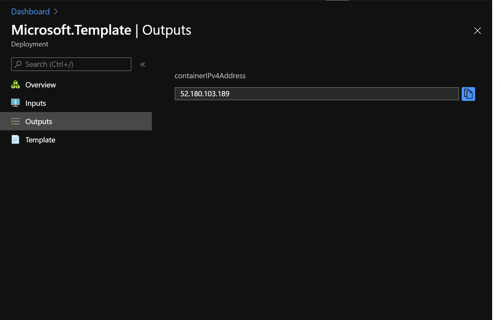
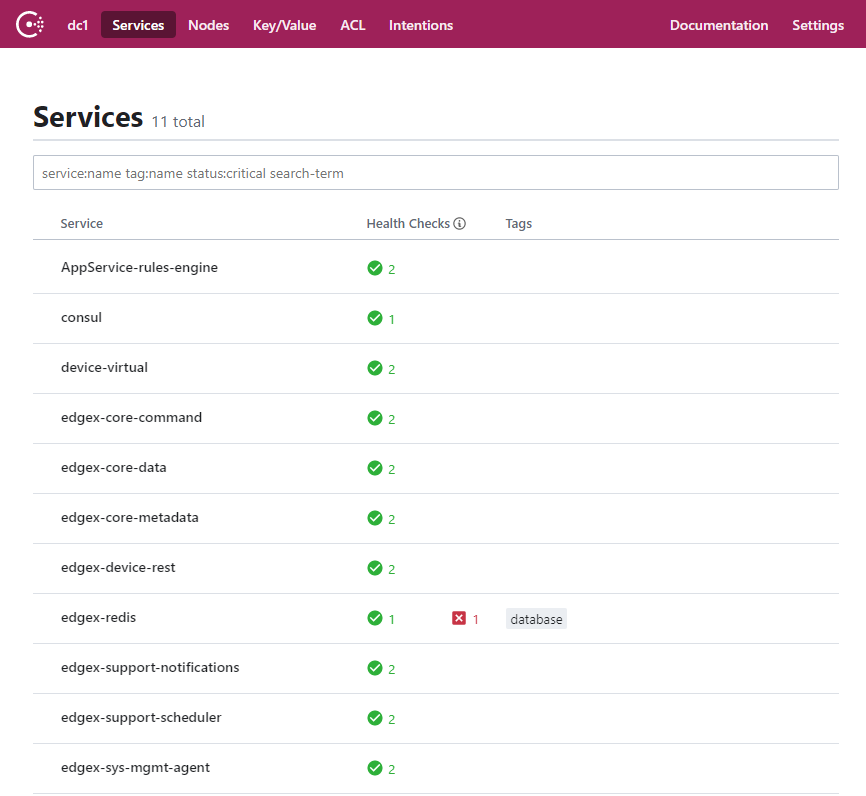

# EdgeX Endorsement

## Introduction

Code, tools, and documentation for validating and endorsing device profiles written by third parties. At a high level you'll need to complete five steps to be eligible for the EdgeX Endorsement Program which will ensure that data provided meets all required components. 

1) Deploy EdgeX using one of the provided cloud templates. Alternatively, you can leverage the latest released compose-file provided here: This ensures a vanilla version of EdgeX is being used without modification to ensure the highest compatibility.
2)  Compose and deploy your device profile using the Device Profile Modeling tool provided [here](https://www.edgexfoundry.org/tbd). This will ensure the profile is validated and has all required components.
2) Run your device locally, configured to point at the cloud instance of the deployed EdgeX to send data to either an MQTT or REST device service.
3) Once deployed, Run the verification script provided to ensure that core-data has been correctly populated with the data that was sent in the previous step.
4) Submit your device profile along with sample data to EdgeX for approval [here](https://www.edgexfoundry.org/tbd).

## 1) Deploy EdgeX

If you want to see how all of EdgeX works - you can leverage your own Azure account and deploy EdgeX to the cloud. This template leverages Azure Container Instances and will deploy a single group called "edgex-example" with 12 services deployed with 2.4 vCPUs allocated (0.2 vCPUs per service) and 6GB of RAM allocated (0.5 GB per service) with an estimated cost of $0.14904 / hour or $3.57696 / day. 

1 container groups * 3600 seconds * 2.4 vCPU * $0.0000135 per vCPU-s  = ~$0.11664

1 container groups * 3600 seconds * 6 GB * $0.0000015 per GB-s  = $0.0324

memory($0.0324) + cpu($0.11664) = $0.14904 / hour
= $3.57696 / day

.

Once deployed, the public IP should be provided in the output of the deployment details.

A couple different ways to ensure the stack has been successfully deployed is to ensure consul status for each service is healthy by visiting http://[ipaddress]:8500. 

> Note: if you get a timeout -- try a few more requests to give proper time for boot-up.

> Note: You can safely ignore the 1 error on edgex-redis

## 2)  Develop Device Profile

Once you have confirmed that EdgeX is running in the cloud. The next step is to develop a device profile. You can learn about developing device profiles [here](https://docs.edgexfoundry.org/1.2/microservices/device/profile/Ch-DeviceProfile/).

Two different types of device services are supported.
 - MQTT
 - REST

## 3) Run your Device

If integrating with EdgeX via REST, follow the documentation [here](https://github.com/edgexfoundry/device-rest-go). 

If integrate with EdgeX via MQTT, follow the documentation [here](https://docs.edgexfoundry.org/1.2/examples/Ch-ExamplesAddingMQTTDevice/
)

## 4) Run the Verification Script

Once you have your device sending data into EdgeX. Run the verification script. 
This script will query EdgeX to ensure that the data you've sent in has successfully been received. 

## 5) Submit

Once the verification script has passed. You'll need to submit some sample data that represents the data that your device will be submitting. 

